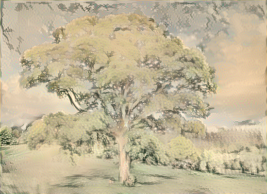
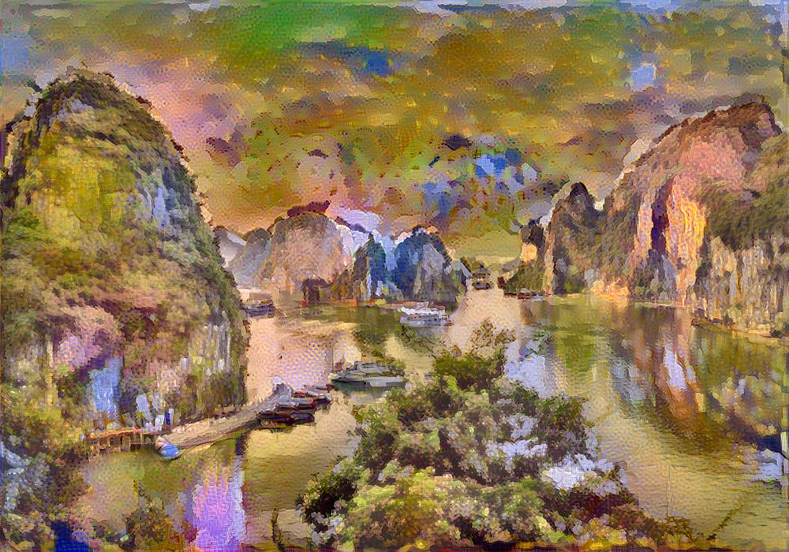
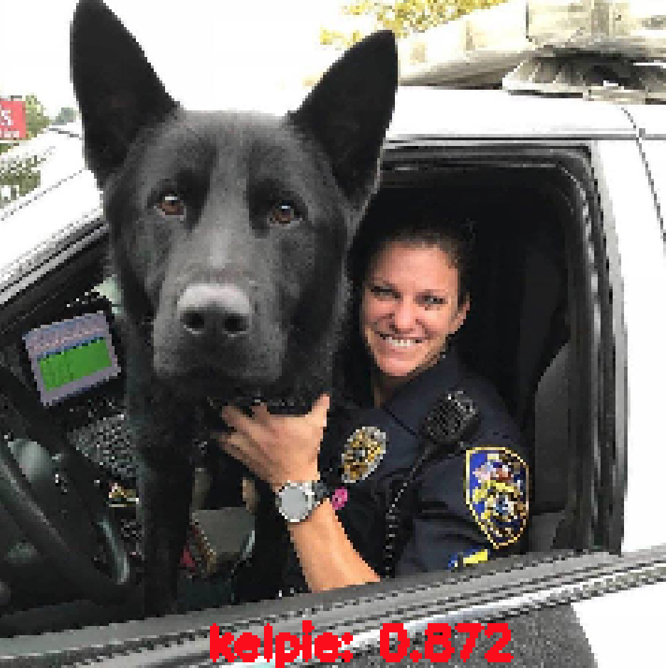
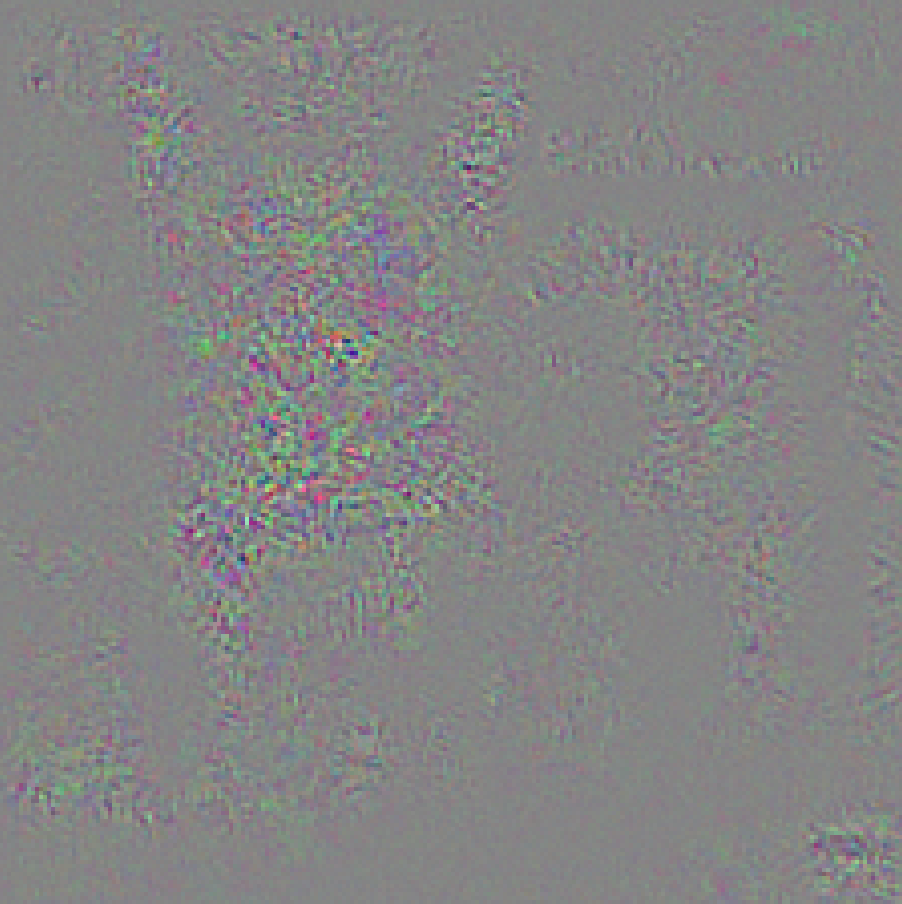
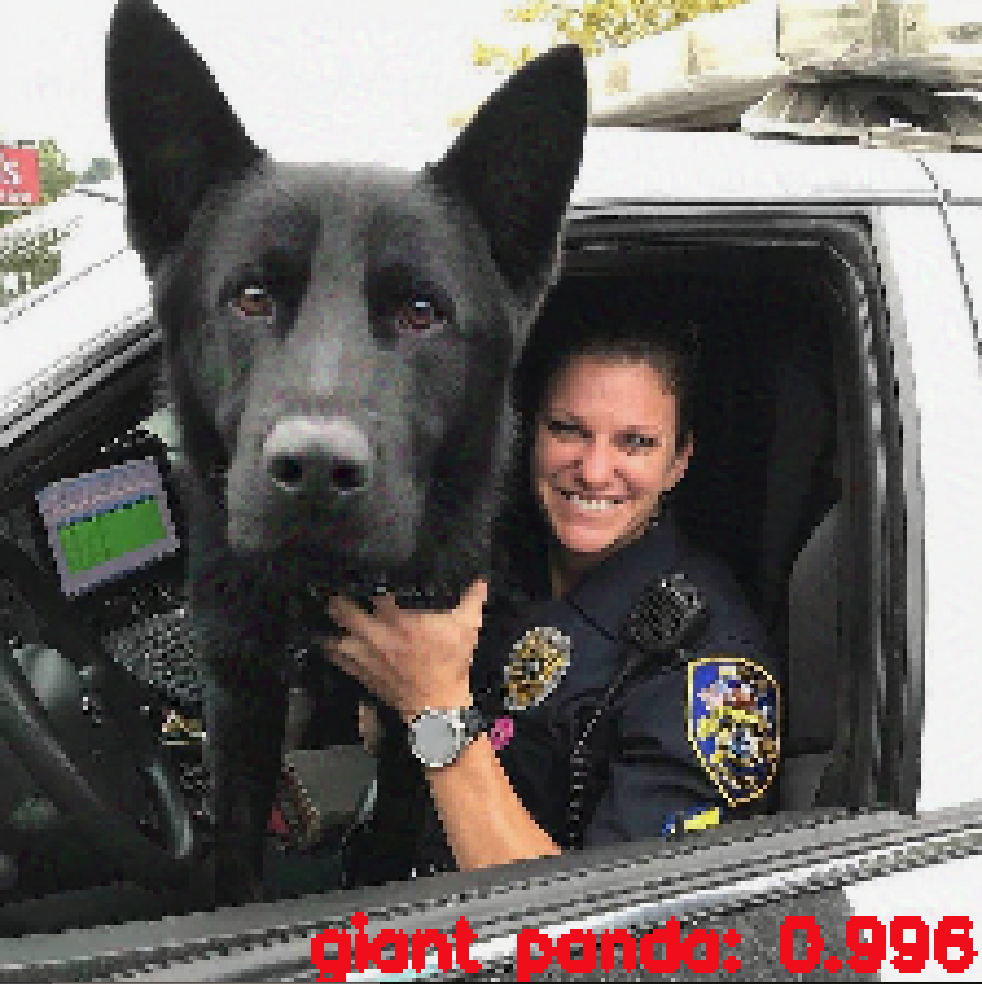
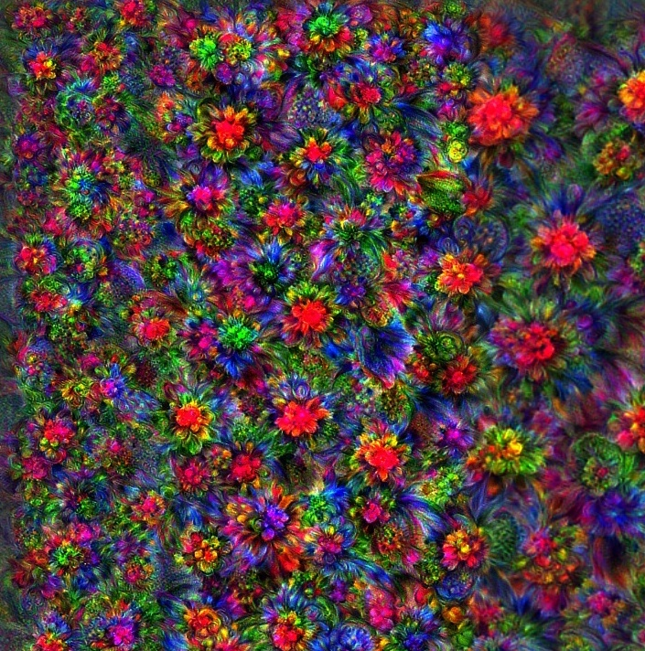
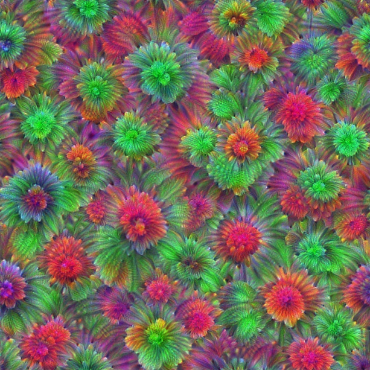
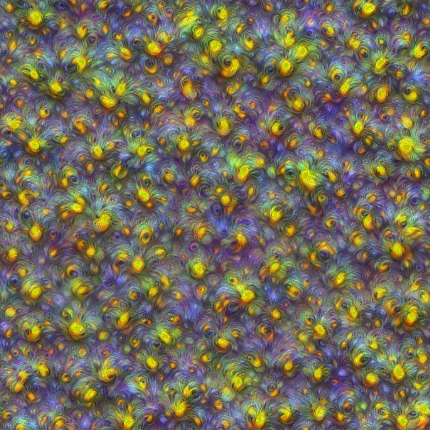
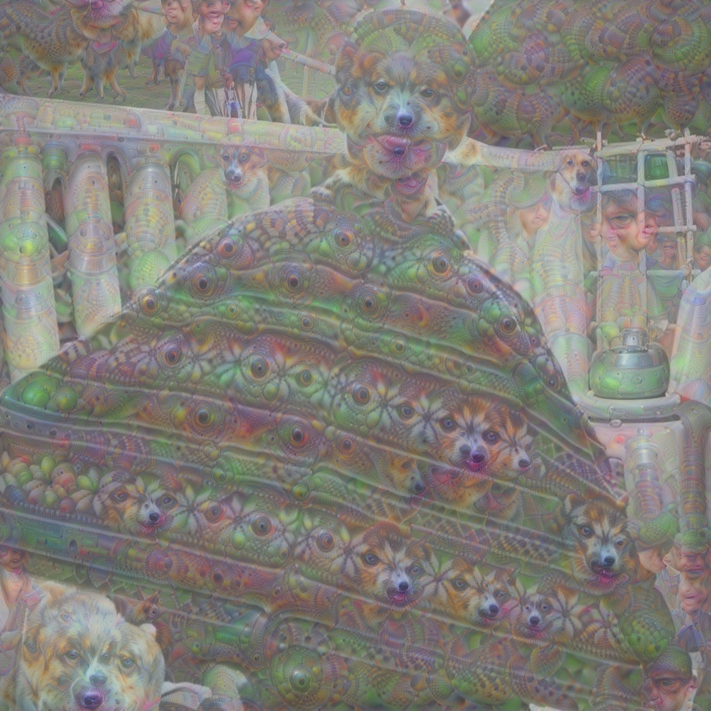

# Visualizing CNN and Neural aesthetics

<a href="https://docs.google.com/presentation/d/1q3oewfa8KgXzNmRahkGQOKR-miF1bRrB-Bq3yYYvClo">Slide</a> about "Visualizing CNNs and Neural aesthetic" topic.

This repository contains **Understanding CNN by visualizing & Neural Style Transfer** tutorial notebook. I further provide an overview of the current progress of NST topic, which is receiving increasing attention from both in academic literature and industrial companies.
  
The `src/` folder contains experiment TensorFlow code for Visualizing CNN (<a href="https://storage.googleapis.com/download.tensorflow.org/models/inception5h.zip">Using Inception_V1 trained model</a>), Fooling CNN by adversarial examples, Refining Neural image & Deep dream.

# Some results from these experiments:
## Neural Style transfer

**Oak Tree styled by <a href="./styles/dwelling.jpg">dwelling image</a>**  
  
**Ha Long Bay styled by <a href="./styles/eva.jpg">eva image</a>**  
   

## Fooling CNN by Adversarial noise

<table border=0 width="50px" >
	<tbody> 
		<tr>		<td width="27%" align="center"> Predicted as <strong>Kelpie</strong>   Confidence: 0.872 </td>
			<td width="27%" align="center">  <strong>Adversarial noise</strong> </td>
			<td width="27%" align="center"> Predicted as <strong>Giant panda</strong>   Confidence: 0.996 </td>
		</tr>
		<tr>
			<td width="27%" align="center">  </td>
			<td width="27%" align="center">  </td>
			<td width="27%" align="center">  </td>
		</tr>
	</tbody>
</table>
 

## Refining neural image
**Tensor Flowers**  
  
  
  
  

## Deepdream
  

  <b>Reference materials:</b> 
  <a href="http://cs231n.stanford.edu/slides/2018/cs231n_2018_lecture13.pdf">1. Stanford CS231n - Visualizing and understanding CNN </a> 
  <a href="https://arxiv.org/abs/1705.04058"> 2. Yongcheng Jing et al.(2018) - Neural Style Transfer: A Review</a> 
  <a href="https://www.cl.cam.ac.uk/teaching/1011/RSL/Richardt.pdf"> 3. Christian Richardt, Rainbow Group - Non-Photorealistic Rendering (NPR)</a> 
  <a href="https://www.coursera.org/learn/convolutional-neural-networks/home/welcome">4. Deeplearning.ai Course 4</a>  
  <a href="https://www.udemy.com/advanced-computer-vision">5. Udemy Advanced Computer Vision</a>  
  <a href="https://ai.googleblog.com/2015/06/inceptionism-going-deeper-into-neural.html">6. Inceptionism: Going Deeper into Neural Networks </a>
    

